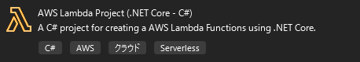

# AWS Lambda 設定手順: .NET 8 Lambda 関数の作成とデプロイ

## メタ情報

* **作成者:** T.Hashima
* **作成日:** 2025-04-25
* **最終更新者:** T.Hashima
* **最終更新日:** 2025-04-25
* **対象AWSリージョン:** ap-northeast-1 (東京)
* **関連ドキュメント/チケット:** なし

---

## 1. 目的 (Objective)

* .NET 8 SDK と AWS Lambda .NET テンプレートを使用して、簡単な "Hello World" Lambda 関数をローカルで作成する。
* Lambda 関数が AWS リソース (CloudWatch Logs など) にアクセスするために必要な基本的な IAM 実行ロールを作成する。
* 作成した .NET 8 関数をビルド、パッケージ化し、手動で作成した ZIP ファイルを AWS Lambda サービスにアップロードしてデプロイする。
* デプロイした Lambda 関数を AWS マネジメントコンソールからテスト実行し、動作を確認する。

---

## 2. 概要・構成 (Overview/Architecture) (任意)

* ローカルの開発環境で .NET 8 Lambda プロジェクトを作成し、必要なコードを実装後、デプロイ用のパッケージ (.zip) を作成します。
* AWS 上に Lambda 関数リソースと、基本的なログ書き込み権限を持つ IAM 実行ロールを作成します。
* 作成したデプロイパッケージ (ZIP ファイル) を AWS マネジメントコンソール経由で Lambda 関数にアップロードします。
* Lambda 関数は、テストイベントによって手動でトリガーされ、実行結果とログを CloudWatch Logs に出力します。

---

## 3. 事前準備 (Prerequisites)

* ツール:

    * .NET 8 SDK: インストール済みであること。コマンドプロンプト/ターミナルで dotnet --version を実行し、8.x.x が表示されることを確認。
    * AWS CLI: (任意だが推奨) AWS認証情報が設定済みであること (aws configure)。
    * AWS Lambda Templates for .NET: Lambda プロジェクトテンプレート。インストールは手順 4.1 で実施。
    * (推奨) AWS Lambda Tools for .NET: デプロイを簡略化する CLI ツール。インストールは手順 4.1 で実施。

---

## 4. 設定手順 (Setup Steps)

### 4.1. ローカル開発環境での準備 (.NET Lambda プロジェクト作成と手動パッケージ化)

1.  **操作:** コマンドプロンプト / ターミナル / ファイルエクスプローラー
    * **手順:**
        1.  Lambda 関数プロジェクトの作成

        

        2.  ソリューション名、プロジェクト名を「LambdaTest」と入力。
        3.  Function.csに以下の内容を追加

            ```csharp
            using Amazon.Lambda.Core;
            using System.Text.Json; // デバッグログでJSON表示する場合に必要

            // Assembly attribute to enable the Lambda function's JSON input to be converted into a .NET class.
            [assembly: LambdaSerializer(typeof(Amazon.Lambda.Serialization.SystemTextJson.DefaultLambdaJsonSerializer))]

            namespace LambdaTest;

            public class Function
            {
                
                /// <summary>
                /// A simple function that takes a string and does a ToUpper
                /// </summary>
                /// <param name="input">The event for the Lambda function handler to process.</param>
                /// <param name="context">The ILambdaContext that provides methods for logging and describing the Lambda environment.</param>
                /// <returns></returns>
                public string FunctionHandler(InputEvent input, ILambdaContext context)
                {
                    context.Logger.LogLine("Loading function");

                    // デバッグ用に受け取ったイベント全体をログ出力したい場合 (Pythonの json.dumps 相当)
                    // context.Logger.LogLine($"Received input: {JsonSerializer.Serialize(input)}");

                    context.Logger.LogLine($"input value1 = {input.Key1}");
                    context.Logger.LogLine($"input value2 = {input.Key2}");
                    context.Logger.LogLine($"input value3 = {input.Key3}");

                    string responseMessage = "入力を確認しました" + input.Key1;
                    context.Logger.LogLine($"Returning message: {responseMessage}"); // 返すメッセージもログに出力

                    return responseMessage;
                }
            }
            ```

        4.  InputEvent.csを追加して以下の内容を追加

            ```csharp
            using System.Text.Json.Serialization;

            namespace LambdaTest
            {
                public class InputEvent
                {
                    /// <summary>
                    /// JSON ペイロードの "key1" に対応するプロパティ。
                    /// </summary>
                    [JsonPropertyName("key1")] // JSONのキー名を明示的に指定
                    public string Key1 { get; set; } = ""; // null 非許容にするためデフォルト値を設定

                    /// <summary>
                    /// JSON ペイロードの "key2" に対応するプロパティ。
                    /// </summary>
                    [JsonPropertyName("key2")]
                    public string Key2 { get; set; } = "";

                    /// <summary>
                    /// JSON ペイロードの "key3" に対応するプロパティ。
                    /// </summary>
                    [JsonPropertyName("key3")]
                    public string Key3 { get; set; } = "";
                }
            }
            ```

        5.  コードの確認 (任意):
            * src/LambdaTest/Function.cs を開き、FunctionHandler メソッドを確認します。ハンドラ文字列は LambdaTest::LambdaTest.Function::FunctionHandler となります。

        6.  デプロイパッケージの作成 (手動): 
            * ターミナルで Lambda プロジェクトのルートディレクトリに移動します。
            * 以下のコマンドを実行して、デプロイ用の zip パッケージを作成します。
            ```Bash
            dotnet lambda package --configuration Release --output-package bin/Release/net8.0/deploy-package.zip
            ```

2.  **操作:** AWS マネジメントコンソールでの操作
    * AWS マネジメントコンソールにログインし、Lambda サービスを開きます。
    * 新規作成の場合:
        * 「関数の作成」をクリックします。
        * 「一から作成」を選択します。
        * 関数名を入力します。
        * ランタイムとして「.NET 8 (C#/F#/VB)」を選択します。
        * アーキテクチャを選択します (x86_64)。
        * 実行ロールを選択または作成します (「基本的な Lambda アクセス権限で新しいロールを作成」など)。
        * 「関数を作成」をクリックします。
    * コードのアップロード:
        * 関数が作成されたら、関数詳細画面の「コードソース」セクションに移動。
        * 「アップロード元」ボタンをクリックし、「.zip ファイル」を選択
        * 「アップロード」ボタンをクリックし、4.1 で手動作成したデプロイパッケージ (deploy-package.zip) を選択します。
        * 「保存」ボタンをクリックしてコードをデプロイします。アップロードと展開に少し時間がかかることがあります。
    * ハンドラ設定の確認/編集:
        * コードのアップロードが完了したら、「ランタイム設定」セクションの「編集」をクリック。
        * 「ハンドラ」フィールドに、4.1 で確認したハンドラ文字列 (例: LambdaTest::LambdaTest.Function::FunctionHandler) が正しく入力されていることを確認（または入力）します。
        * 「保存」をクリック。

---

## 5. 確認・テスト (Verification/Testing)

* デプロイした Lambda 関数が正しく動作するかを確認します。

1.  **操作:** AWS マネジメントコンソール
    1. Lambda コンソールで作成した関数 (MyNet8Function) を選択。
    2. 「テスト」タブを開く。
    3. テストイベント:
        * 「新しいイベントを作成」を選択。
        * イベント名: MyTestEvent など任意の名を入力。
        * イベント JSON: FunctionHandler が文字列を受け取るので、テスト用の文字列をJSON形式で入力します。
        ```JSON
        {
            "key1": "value1",
            "key2": "value2",
            "key3": "value3"
        }
        ```
        * 「保存」をクリックしてテストイベントを作成。
    4. 保存した MyTestEvent が選択されていることを確認し、「テスト」ボタンをクリック。
    5. 実行結果:
        * 実行が完了すると、「実行結果」タブが表示されます。
        * 「ステータス: 成功」と表示されることを確認します。
        * 「応答」セクションに、FunctionHandler が返した値 (例: "HELLO LAMBDA FROM MANUAL ZIP") が表示されることを確認します。
        * 「関数ログ」セクションに、context.Logger.LogInformation で出力したログ (例: Received input: hello lambda from manual zip) が表示されることを確認します。

