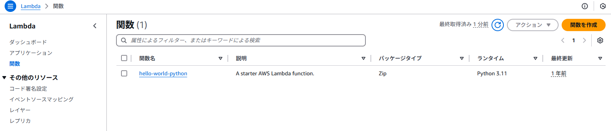
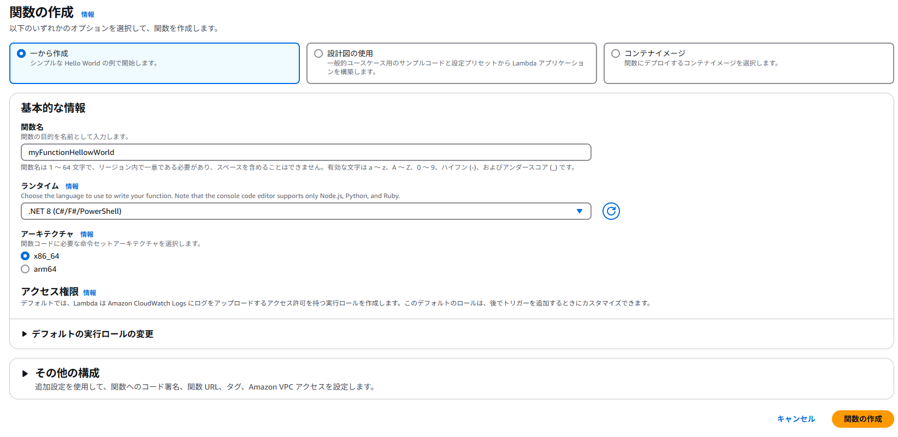
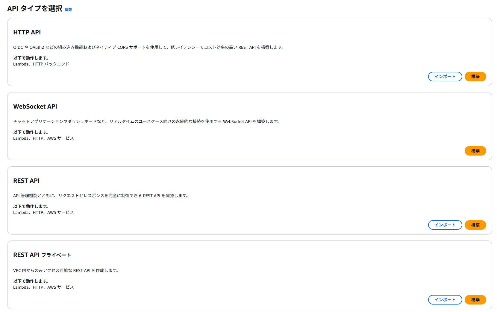
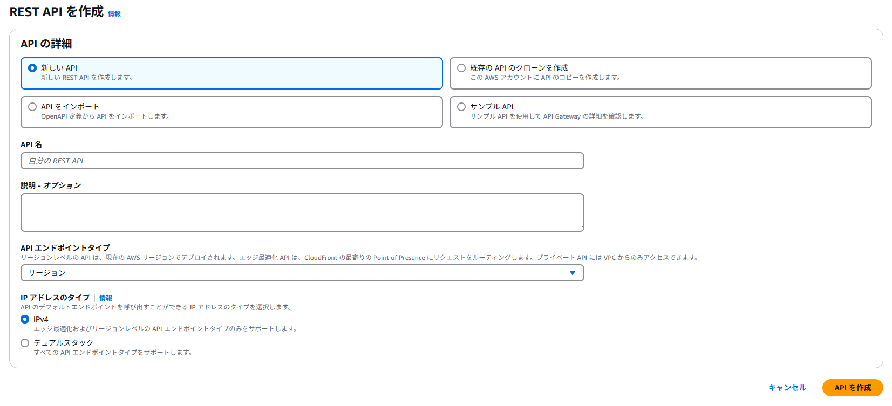
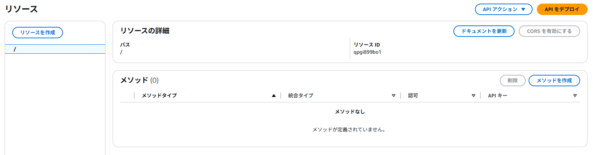
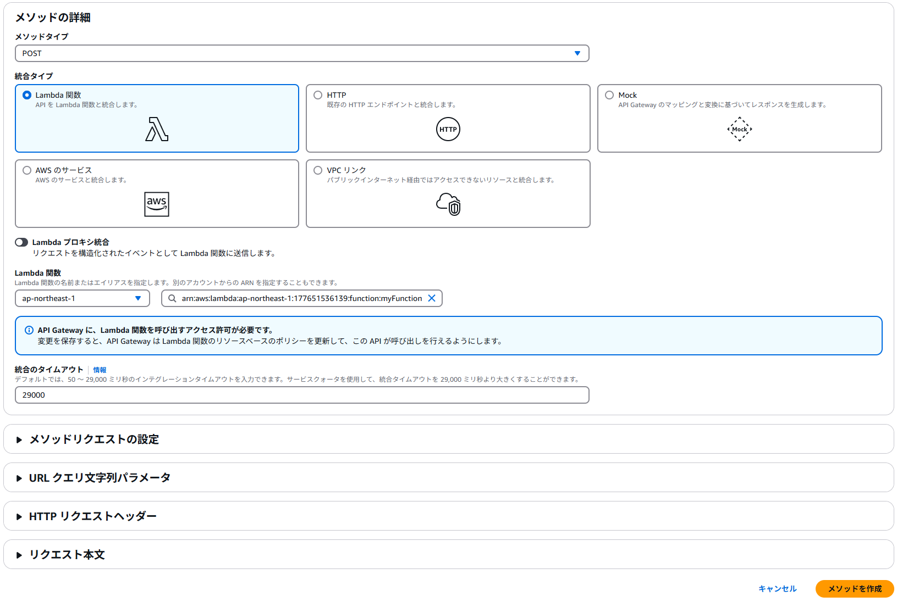
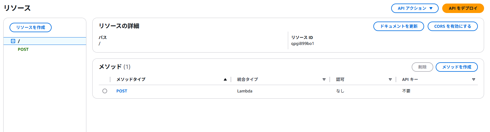
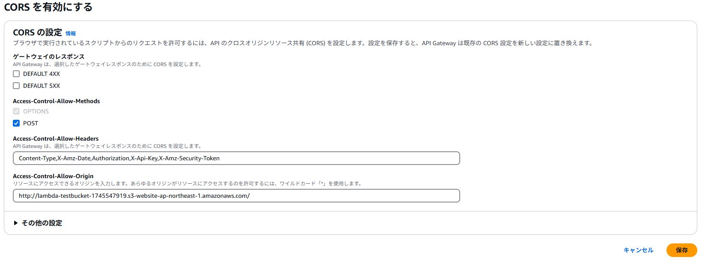

# 技術調査レポート: API GatewayとLambdaで簡易Webアプリ

## メタ情報

* **調査担当者:** T.Hashima
* **調査開始日:** 2025-04-25
* **最終更新日:** 2025-04-25
* **対象AWSリージョン:** ap-northeast-1 (東京)

---

## 1. 目的 (Objective)

* Amazon S3を利用して、指定したAWSリージョンに新しいS3バケットを作成する。
* 作成したS3バケットで**静的ウェブサイトホスティングを有効化**し、サンプルとして `index.html` ファイルを配置して**WebブラウザからHTTPでアクセスできるようにする**。

---

## 2. 概要・構成 (Overview/Architecture) (任意)

### 2.1. Amazon API Gateway

* API Gatewayは、APIの作成・管理が可能なフルマネージドサービスです。HTTP API または REST API を使用して RESTful API を作成することができます。
* API Gatewayは、クライアントからリクエストを受け取ってバックエンドに渡し、バックエンドからのレスポンスをクライアントに返します。なお、本記事のバックエンドはLambdaになります。

### 2.2. AWS Lambda

* AWS Lambdaは、サーバーレスのコンピューティングサービスです。ユーザ自身でサーバーのプロビジョニングや管理をする必要なく、事前に作成しておいたプログラムをイベント駆動で実行することができます。イベントの例を挙げると、Amazon API Gateway 経由のHTTP リクエストやAmazon S3バケット内のオブジェクト変更などです。また、実行するプログラムは、Go、Java、Python（以下略）等の複数の言語で記述することができます。

---

## 3. 事前準備 (Prerequisites)

---

## 4. 設定手順 (Setup Steps)

### 4.1. フロントエンドの作成

    ```html
<!DOCTYPE html>
<html>
<head>
<meta charset="UTF-8">
<title>HTMLファイルからPOSTでJSONデータを送信する</title>
<script type="text/javascript" src="http://ajax.googleapis.com/ajax/libs/jquery/2.1.0/jquery.min.js"></script>

<script type="text/javascript">
    $(function(){
        $("#response").html("Response Values");

        $("#button").click( function(){
            // ここのURLはAPIのデプロイ時に表示されるURL（後述）に差し替える
            var url = "https://xxxxxx.execute-api.ap-northeast-1.amazonaws.com/dev";
                var JSONdata = {
                    "key1": $("#text").val()
                };

            alert(JSON.stringify(JSONdata));

            $.ajax({
                type : 'post',
                url : url,
                data : JSON.stringify(JSONdata),
                contentType: 'application/json',
                dataType : 'json',
                scriptCharset: 'utf-8',
                success : function(data) {

                    // Success
                    alert("success");
                    alert(JSON.stringify(data));
                    $("#response").html(JSON.stringify(data));
                },
                error : function(data) {

                    // Error
                    alert("error");
                    alert(JSON.stringify(data));
                    $("#response").html(JSON.stringify(data));
                }
            });
        })
    })
</script>

</head>
<body>
    <h1>HTMLファイルからPOSTでJSONデータを送信する</h1>
    <p>入力テキスト: <input type="text" id="text" size="30" placeholder="テキストを入力してください"></p>
    <p><button id="button" type="button">送信</button></p>
    <textarea id="response" cols=120 rows=10 disabled></textarea>
</body>
</html>
    ```


### 4.2. Lambda関数の作成

* 関数を作成をクリック


* 一から作成を選択
* ランタイムを「.NET 8」を選択


* 関数の作成をクリック


### 4.3. APIの作成

* 「APIを作成」をクリック
* REST APIを選択

* API名以外はそのまま

* 「メソッドを作成」をクリック

* メソッドタイムに「POST」を選択
* 統合タイプに「lambda関数」を選択
* Lambda関数に目的のLambda関数を選択

* CORSを有効にする




---

## 5. 参考資料 (References)

* [調査過程で参考にしたWebサイト、公式ドキュメント、書籍、ブログ記事などのリスト。]
* [URLだけでなく、タイトルや簡単な内容も添えると後で見返しやすいです。]
    * [API GatewayとLambdaで簡易Webアプリを作ってみる - URL](https://qiita.com/moufuyu/items/340048eef98d98f11187)
