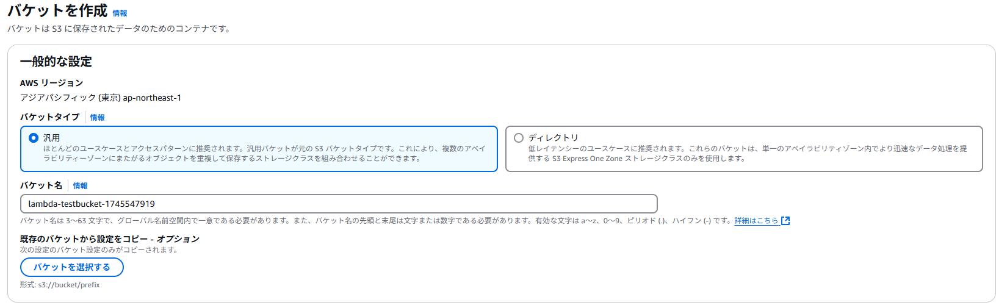

# Amazon S3 設定手順: 新しいS3バケットの作成と静的Webサイト公開

## メタ情報

* **作成者:** T.Hashima
* **作成日:** 2025-04-25
* **最終更新者:** T.Hashima
* **最終更新日:** 2025-04-25
* **対象AWSリージョン:** ap-northeast-1 (東京)
* **関連ドキュメント/チケット:** なし

---

## 1. 目的 (Objective)

* Amazon S3を利用して、指定したAWSリージョンに新しいS3バケットを作成する。
* 作成したS3バケットで**静的ウェブサイトホスティングを有効化**し、サンプルとして `index.html` ファイルを配置して**WebブラウザからHTTPでアクセスできるようにする**。

## 2. 概要・構成 (Overview/Architecture) (任意)

* Amazon S3サービス内に、指定されたリージョンと一意の名称を持つバケットリソースを作成します。
* 作成後、バケットの**静的ウェブサイトホスティング機能**を有効化します。
* バケット内のオブジェクト (`index.html` など) に**パブリック読み取りアクセスを許可**するため、**パブリックアクセスブロック設定を一部解除**し、適切な**バケットポリシー**を設定します。

    ```mermaid
    graph LR;
        User[Web Browser User] -- HTTP Request --> S3Website[S3 Static Website Endpoint];
        S3Website -- Reads --> S3Bucket[(S3 Bucket)];
        S3Bucket -- Contains --> IndexHTML(index.html);
        S3Bucket -- Evaluates --> BucketPolicy{Bucket Policy};
        BucketPolicy -- Allows --> S3GetObjectAction(s3:GetObject for *);
        S3Bucket -- Checks --> PublicAccessBlock{Public Access Block};
        PublicAccessBlock -- Allows Public Policy --> BucketPolicy;
    ```
    *(ユーザーがWebサイトエンドポイントにアクセスすると、S3はパブリックアクセスブロック設定とバケットポリシーを評価し、許可されていれば index.html の内容を返す)*

## 3. 事前準備 (Prerequisites)


## 4. 設定手順 (Setup Steps)

### 4.1. S3バケットの作成

1.  **操作:** AWSマネジメントコンソール
    * **手順:**
        1.  AWSマネジメントコンソールにログインし、S3サービスを開く。
        2.  「バケット」ページで「バケットを作成」をクリック。
        3.  **一般設定:**
            * **バケット名:** [事前準備で決めた一意のバケット名] を入力。
            * **AWS リージョン:** [事前準備で決めたリージョン] を選択。
            
        4.  **オブジェクト所有者:** デフォルト (`ACL 無効 (推奨)`) のままにします。
            
        5.  **このバケットのブロックパブリックアクセス設定:**
            * **重要:** ここでは**一旦「パブリックアクセスをすべて ブロック」のチェックを外します**。静的ウェブサイトホスティングにはパブリックアクセス許可が必要なためです。後ほどバケットポリシーで制御します。チェックを外すと警告が表示されるので、内容を理解した上で「現在の設定により、このバケットと中のオブジェクトが公開される可能性があることを承認します。」にチェックを入れます。
            * **代替案:** すべてブロックしたままバケットを作成し、後のステップ(`4.3`)で必要なブロックのみを解除することも可能です（より安全）。
            
        6.  (オプション) バケットのバージョニング、タグ、デフォルトの暗号化を設定。
        7.  「バケットを作成」をクリック。
    * **確認:** バケット一覧画面に作成したバケットが表示されることを確認する。

2.  **操作:** Web サイトホスティングを有効化
    * **手順:**
        1.  作成したバケットを開く。
        
        2.  「静的ウェブサイトホスティング」の編集ボタンをクリック。
        
        3. 静的ウェブサイトホスティングを有効にする。インデックスドキュメントにindex.htmlと入力。
        
        4. 変更の保存をクリック

3.  **操作:** アクセス権限を編集
    * **手順:**
        1.  「アクセス許可」タブを開く。
        
        2. アクセス権限を編集
        3. バケットポリシーの編集をクリックし、次の json を貼り付けて、変更の保存 をクリック

    ```json
    {
        "Version": "2012-10-17",
        "Statement": [
            {
                "Sid": "PublicReadGetObject",
                "Effect": "Allow",
                "Principal": "*",
                "Action": [
                    "s3:GetObject"
                ],
                "Resource": [
                    "arn:aws:s3:::Bucket-Name/*"
                ]
            }
        ]
    }
    ```

3.  **操作:** ファイルのアップロード
    * **手順:**
        1.  「アップロード」からファイルをアップロードする。
        

### 4.2. 静的ウェブサイトホスティングの有効化

1.  **操作:** AWSマネジメントコンソール
    * **手順:**
        1.  作成したバケットを開く。
        
        2.  「静的ウェブサイトホスティング」の編集ボタンをクリック。
        
        3. 静的ウェブサイトホスティングを有効にする。インデックスドキュメントにindex.htmlと入力。
        
        4. 変更の保存をクリック

2.  **操作:** アクセス権限を編集
    * **手順:**
        1.  「アクセス許可」タブを開く。
        
        2. アクセス権限を編集
        3. バケットポリシーの編集をクリックし、次の json を貼り付けて、変更の保存 をクリック

    ```json
    {
        "Version": "2012-10-17",
        "Statement": [
            {
                "Sid": "PublicReadGetObject",
                "Effect": "Allow",
                "Principal": "*",
                "Action": [
                    "s3:GetObject"
                ],
                "Resource": [
                    "arn:aws:s3:::Bucket-Name/*"
                ]
            }
        ]
    }
    ```

3.  **操作:** ファイルのアップロード
    * **手順:**
        1.  「アップロード」からファイルをアップロードする。
        


---

## 5. 確認・テスト (Verification/Testing)

* 設定が正しく完了し、Webサイトとしてアクセスできるかを確認します。
    1.  **静的ウェブサイトエンドポイントURLの確認:**
        * **コンソール:** バケットの「プロパティ」タブ -> 「静的ウェブサイトホスティング」セクションにあるエンドポイントURLをコピーします。形式は `http://<bucket-name>.s3-website-<AWS-Region>.amazonaws.com` または `http://<bucket-name>.s3-website.<AWS-Region>.amazonaws.com` です。
        * **CLI:**
            ```bash
            # BUCKET_NAME 変数が設定されている前提
            # リージョン取得
            REGION=$(aws s3api get-bucket-location --bucket ${BUCKET_NAME} --query 'LocationConstraint' --output text)
            # us-east-1 の場合は null が返るので調整
            if [ "$REGION" = "null" ] || [ -z "<span class="math-inline">REGION" \]; then REGION\="us\-east\-1"; fi
\# リージョンによってエンドポイント形式が異なる場合があるため注意
\# 一般的な形式 \(\- 区切り\)\:
WEBSITE\_URL\_DASH\="http\://</span>{BUCKET_NAME}.s3-website-<span class="math-inline">\{REGION\}\.amazonaws\.com"
\# ピリオド区切り形式\:
WEBSITE\_URL\_DOT\="http\://</span>{BUCKET_NAME}.s3-website.${REGION}.amazonaws.com"

            echo "Website Endpoint URL (Dash Format): ${WEBSITE_URL_DASH}"
            echo "Website Endpoint URL (Dot Format) : <span class="math-inline">\{WEBSITE\_URL\_DOT\}"
echo "\(Check AWS Console for the definitive URL for your region\)"
\# 実際にアクセス試行するなら片方を選択 \(コンソールで確認した形式推奨\)
WEBSITE\_URL\=</span>{WEBSITE_URL_DASH} # または DOT
            ```
    2.  **Webブラウザでのアクセス:**
        * コピーしたエンドポイントURLをWebブラウザのアドレスバーに貼り付けてアクセスします。
        * 事前準備で作成した `index.html` の内容 (例: "Welcome to my S3 Static Website!") が表示されることを確認します。
    3.  **curl コマンドでのアクセス:**
        * ターミナルで `curl` コマンドを使ってアクセスし、HTMLソースが返ってくることを確認します。
            ```bash
            # WEBSITE_URL 変数が設定されている前提
            curl ${WEBSITE_URL}
            # またはコンソールで確認した正確なURLを使用:
            # curl [http://your-bucket-name.s3-website-ap-northeast-1.amazonaws.com](http://your-bucket-name.s3-website-ap-northeast-1.amazonaws.com)
            ```
        * 期待されるHTML (例: `<h1>Welcome to my S